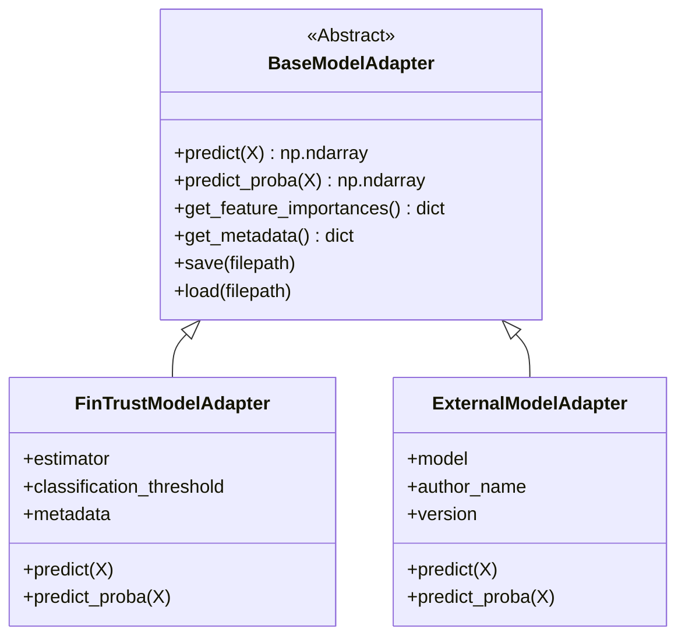

# FinTrust ML Workflow — Integration-Ready Development (Week 3)
### Machine Learning Engineering Track | FinTrust Digital Banking Case Study

[](https://www.python.org/)
[](https://scikit-learn.org/)
[](https://fastapi.tiangolo.com/)
[-brightgreen.svg)](tests/)
[](Dockerfile)
[](docs/WEEK3_DOCUMENTATION.md)

An enterprise-grade, reproducible Machine Learning Engineering system designed for **FinTrust** to detect high-risk banking transactions requiring automated triage and fraud investigation (`Risk_Review_Flag`).

Week 3 elevates the Week 2 baseline prototype into a **production-grade, multi-table, integration-ready platform** featuring **Relational Data Preparation & PII Redaction**, **Standardized Model Adapter Interfaces**, **30 Automated Technical Tests**, **FastAPI Microservice Serving**, **Docker Containerization**, and **Downloadable Mentor Guides**.

---

## 📑 Table of Contents
1. [Project Overview & 7-Stage Architecture](#-project-overview--7-stage-architecture)
2. [Repository Structure](#-repository-structure)
3. [Part A — Review of Week 2 Workflow (Audit & Gap Analysis)](#-part-a--review-of-week-2-workflow)
4. [Part B — Complete ML Pipeline & Relational Data Preparation](#-part-b--complete-ml-pipeline--data-preparation)
5. [Part C — Model Integration & The Adapter Pattern](#-part-c--model-integration--the-adapter-pattern)
6. [Part D — 30-Point Technical Testing Matrix](#-part-d--30-point-technical-testing-matrix)
7. [Part E — FastAPI Real-Time & Batch Microservice](#-part-e--fastapi-real-time--batch-microservice)
8. [Part F — Reproducibility, Docker & Execution Guide](#-part-f--reproducibility-docker--execution-guide)
9. [Deliverables & Mentor Teaching Assets](#-deliverables--mentor-teaching-assets)

---

## 🏛 Project Overview & 7-Stage Architecture

FinTrust processes millions of transactions. Suspicious events must be detected in real time while minimizing false positives for legitimate clients.


### Enterprise Architectural Highlights:
- **Multi-Table Relational Enrichment:** Merges 1,500 customer demographic profiles with 12,000 transaction records on `Customer_ID` with 100% match rate.
- **NDPR/GDPR Data Privacy:** Completely redacts `Customer_Name` PII before caching or model consumption.
- **Model Adapter Pattern (Part C):** Decouples model implementations from serving via `BaseModelAdapter`, allowing internal and external Data Science models to plug in interchangeably.
- **Customer Feature Store Lookup:** If incoming API transactions contain only raw transaction fields, the pipeline automatically looks up customer attributes from the customer cache.
- **Calibrated Risk Tiers:** Translates raw probabilities into actionable operations actions: **Low** (Auto-Approve), **Medium** (SMS OTP Verification), and **High** (Immediate Payment Hold).

---

## 📂 Repository Structure

```
ANALYSTLAB ML WEEK 2 LAB/
├── Dockerfile                                      # Multi-stage production container definition
├── .dockerignore                                   # Build context exclusion filter
├── README.md                                       # Master project documentation
├── requirements.txt                                # Pinned dependencies specification
├── main.py                                         # Unified CLI entry point
├── check_all.py                                    # Master 34-check system diagnostic script
│
├── FinTrust_ML_Workflow_Week3_Mentor_Guide.docx     # Editable Word Playbook for Mentors
├── FinTrust_ML_Workflow_Week3_Intern_Presentation.pptx # Editable PowerPoint Presentation Deck
│
├── data/
│   ├── raw/
│   │   ├── FinTrust_Customer_Data.xlsx             # Raw customer master data (1,500 records)
│   │   └── FinTrust_Transaction_Data.xlsx          # Raw transaction dataset (12,000 records)
│   └── processed/
│       ├── fintrust_enriched.csv                   # Enriched master dataset (12,000 records)
│       ├── fintrust_train.csv                      # Stratified train split (9,600 records)
│       ├── fintrust_test.csv                       # Stratified test split (2,400 records)
│       ├── customers_cleaned.csv                   # Clean customer feature cache (PII redacted)
│       └── scored_batch_output.csv                 # Scored batch output
│
├── src/
│   ├── __init__.py
│   ├── config.py                                   # Centralized paths, FeatureSchema & thresholds
│   ├── data/                                       # Part B: Multi-table data preparation
│   │   ├── __init__.py
│   │   └── prepare.py                              # DataPreparator (PII redaction & left join)
│   ├── validation/                                 # Part B: Data validation firewall
│   │   ├── __init__.py
│   │   ├── schema.py                               # Validation report dataclasses
│   │   └── validator.py                            # DataValidator (6 strict checks)
│   ├── preprocessing/                              # Part B: Feature pipeline
│   │   ├── __init__.py
│   │   └── pipeline.py                             # Temporal extractor & 60-feature ColumnTransformer
│   ├── models/                                     # Part C: Model adapter & training
│   │   ├── __init__.py
│   │   ├── interface.py                            # BaseModelAdapter, FinTrustAdapter, ExternalAdapter
│   │   ├── train.py                                # Baseline vs Production Random Forest training
│   │   └── predict.py                              # 7-stage prediction engine with auto-enrichment
│   └── api/                                        # Part E: FastAPI prediction service
│       ├── __init__.py
│       ├── schemas.py                              # Pydantic schemas (single, enriched, batch)
│       └── app.py                                  # Lifespan-managed FastAPI microservice
│
├── tests/                                          # Part D: 30-Point Technical Test Suite
│   ├── __init__.py
│   ├── test_validation.py                          # 7 validation unit tests
│   ├── test_preprocessing.py                       # 3 preprocessing & leakage tests
│   ├── test_model_integration.py                   # 5 model adapter & interface tests
│   ├── test_prediction.py                          # 6 end-to-end 7-stage & reproducibility tests
│   ├── test_data_preparation.py                    # 3 join integrity & PII redaction tests
│   └── test_api.py                                 # 6 FastAPI HTTP endpoint tests
│
├── artifacts/                                      # Serialized ML artifacts
│   ├── preprocessor.joblib                         # Fitted 60-feature ColumnTransformer
│   ├── model.joblib                                # Trained FinTrustModelAdapter
│   ├── metrics.json                                # Test evaluation metrics
│   └── model_metadata.json                         # Model governance & audit metadata
│
├── notebooks/                                      # Interactive Walkthroughs
│   └── walkthrough.ipynb                           # Step-by-step intern walkthrough
│
└── docs/                                           # Technical Reports & Review
    ├── WEEK2_WORKFLOW_REVIEW.md                    # Part A: Formal Week 2 audit & gap analysis
    ├── WEEK3_TEST_REPORT.md                        # Part D: 30-test matrix & execution logs
    ├── WEEK3_DOCUMENTATION.md                      # Week 3 Architecture & Deliverables Guide
    ├── MENTOR_GUIDE.md                             # Mentor teaching notes
    └── DATA_DICTIONARY.md                          # Full attribute definitions
```

---

## 🔍 Part A — Review of Week 2 Workflow

A formal review was conducted in [`docs/WEEK2_WORKFLOW_REVIEW.md`](docs/WEEK2_WORKFLOW_REVIEW.md) identifying:
1. **Incomplete Components:** Single-table isolation (ignored customer profile context), absence of a standardized model adapter interface, and lack of customer profile validation rules.
2. **Technical Weaknesses:** Plaintext PII (`Customer_Name`) stored in data files, tight coupling of inference code to a single model class, and deprecated FastAPI startup handlers.
3. **Testing Gaps:** Missing tests for customer demographic domains, model adapter contract adherence, and deterministic random seed reproducibility.
4. **Reproducibility Issues:** Lack of containerization specifications (`Dockerfile`) for cross-platform Linux/Docker deployments.

---

## 🛠 Part B — Complete ML Pipeline & Relational Data Preparation

Located in `src/data/prepare.py` and `src/preprocessing/pipeline.py`:

1. **Relational Enrichment:** Left-joins `FinTrust_Transaction_Data.xlsx` (12,000 rows) with `FinTrust_Customer_Data.xlsx` (1,500 rows) on `Customer_ID`.
2. **PII Redaction:** Drops `Customer_Name` in compliance with NDPR/GDPR privacy regulations.
3. **Data Validation Firewall (`src/validation/validator.py`):** Executes 6 checks across both transaction and customer dimensions:
   - Empty dataset rejection
   - Column schema validation
   - Type integrity
   - Missing value thresholding
   - Categorical domain constraints
   - Numeric boundaries (`Amount > 0`, `18 <= Age <= 100`, `Tenure >= 0`, `0 <= Digital_Score <= 100`).
4. **Feature Engineering & Leakage Protection:**
   - Temporal signals derived: `Transaction_Hour`, `Transaction_DayOfWeek`, `Is_Weekend`.
   - Scalers and imputers fitted **strictly on training set** and frozen into a 60-dimensional feature pipeline.

---

## 🔌 Part C — Model Integration & The Adapter Pattern

Located in `src/models/interface.py`:



### Model Comparison Results:
| Metric | Baseline (Logistic Regression) | Production (Random Forest) |
|---|---|---|
| **ROC-AUC Score** | 0.6693 | **0.6649** |
| **Recall (Fraud Detection Rate)** | 88.72% | **83.62%** |
| **Precision** | 22.40% | **25.13%** |
| **F1-Score** | 0.3578 | **0.3864** |
| **Brier Score Calibration** | 0.2104 | **0.1994** |

---

## 🧪 Part D — 30-Point Technical Testing Matrix

The automated test suite in `tests/` contains **30 tests** covering all 9 required testing dimensions:

```bash
./venv/bin/pytest tests/ -v
```

| Dimension | Tests Implemented | Result |
|---|---|:---:|
| **1. Valid Input** | `test_valid_input`, `test_end_to_end_valid_prediction` | **PASSED** |
| **2. Missing Values** | `test_missing_values_warning_and_error`, `test_missing_value_imputation` | **PASSED** |
| **3. Unexpected Categories** | `test_unexpected_category`, `test_unexpected_customer_category`, `test_unseen_categories_handling` | **PASSED** |
| **4. Invalid Data Types** | `test_incorrect_data_type` | **PASSED** |
| **5. Empty Input** | `test_empty_dataset` | **PASSED** |
| **6. Model Loading** | `test_model_loading` | **PASSED** |
| **7. Prediction Generation** | `test_prediction_generation`, `test_end_to_end_valid_prediction` | **PASSED** |
| **8. Output Format** | `test_output_format`, `test_end_to_end_output_format` | **PASSED** |
| **9. Reproducibility** | `test_end_to_end_reproducibility` | **PASSED** |
| **+ Data Join & PII** | `test_data_preparation_execution`, `test_pii_redaction`, `test_join_completeness` | **PASSED** |
| **+ Model Adapter** | `test_external_model_adapter_compatibility`, `test_model_metadata_audit` | **PASSED** |
| **+ FastAPI Endpoints** | `test_health_endpoint`, `test_model_metadata_endpoint`, `test_predict_endpoint_auto_enrichment`, `test_predict_enriched_endpoint`, `test_predict_batch_endpoint`, `test_predict_invalid_input_validation` | **PASSED** |

*See full details in [`docs/WEEK3_TEST_REPORT.md`](docs/WEEK3_TEST_REPORT.md).*

---

## 🌐 Part E — FastAPI Real-Time & Batch Microservice

Launch the prediction service:
```bash
python main.py --serve
```
- **Base URL:** `http://127.0.0.1:8000`
- **Interactive Swagger Documentation:** `http://127.0.0.1:8000/docs`

### Exposed Endpoints:
- `GET /health`: Liveness & model readiness health check.
- `GET /model/metadata`: Model governance metadata, version, and evaluation metrics.
- `POST /predict`: Real-time transaction scoring with customer cache auto-enrichment.
- `POST /predict/enriched`: Scoring with client-supplied customer demographics.
- `POST /predict/batch`: High-throughput batch scoring.

---

## 💻 Part F — Reproducibility, Docker & Execution Guide

### 1. Installation:
```bash
python3 -m venv venv
source venv/bin/activate
pip install -r requirements.txt
```

### 2. Multi-Table Data Preparation:
```bash
python main.py --prepare-data
```

### 3. Model Training & Adapter Export:
```bash
python main.py --train
```

### 4. 7-Stage Sample Prediction Walkthrough:
```bash
python main.py --predict-sample
```

### 5. Batch CSV Scoring:
```bash
python main.py --predict-batch data/processed/fintrust_test.csv
```

### 6. Run 30 Automated Technical Tests:
```bash
python main.py --test
```

### 7. Master System Diagnostic (One-Click Check):
```bash
python check_all.py
```

### 8. Docker Deployment:
```bash
# Build Docker image
docker build -t fintrust-ml:week3 .

# Run container
docker run -p 8000:8000 fintrust-ml:week3
```

---

## 📦 Deliverables & Mentor Teaching Assets

| Deliverable | File Path | Description |
|---|---|---|
| **1. Updated Repository** | Entire workspace | Modular, enterprise-grade ML codebase |
| **2. Integrated ML Pipeline** | `src/models/predict.py` | 7-stage prediction engine with auto-enrichment |
| **3. Preprocessing Components** | `src/preprocessing/pipeline.py` | 60-feature ColumnTransformer & temporal extractor |
| **4. Model Integration** | `src/models/interface.py` | BaseModelAdapter, FinTrustAdapter, ExternalAdapter |
| **5. Technical Tests** | `tests/` (30 Tests) | 100% passing test matrix mapped to all criteria |
| **6. API / Service** | `src/api/app.py` | Modern lifespan-managed FastAPI microservice |
| **7. Master README** | `README.md` | Comprehensive system and execution manual |
| **8. Requirements File** | `requirements.txt` | Complete pinned dependency manifest |
| **9. Reproducibility Evidence** | `Dockerfile`, `check_all.py` | Container spec and 34-check master diagnostic |
| **10. Week 3 Documentation** | `docs/WEEK3_DOCUMENTATION.md` | Architecture and technical specification |
| **+ Word Playbook** | `FinTrust_ML_Workflow_Week3_Mentor_Guide.docx` | Downloadable & editable Word teaching playbook |
| **+ Presentation Deck** | `FinTrust_ML_Workflow_Week3_Intern_Presentation.pptx` | Downloadable & editable 11-slide PowerPoint deck |
