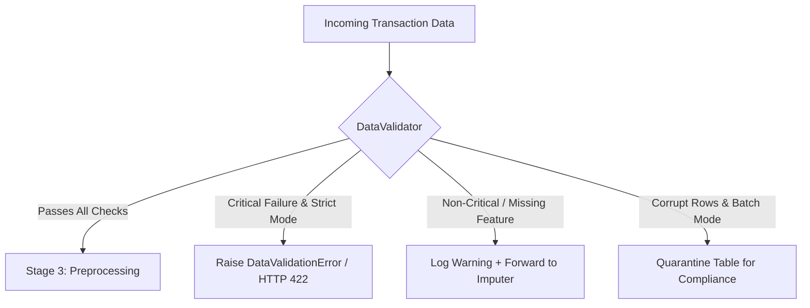
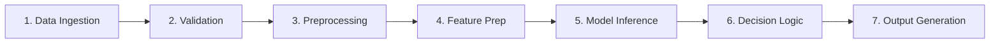

# FinTrust ML Workflow — Mentor Walkthrough & Teaching Guide

**Target Audience:** ML Mentors, Instructors, and Machine Learning Engineering Interns  
**Curriculum Track:** Machine Learning Engineering Track (Week 2: Initial Implementation)  
**Case Study:** FinTrust Banking & FinTech Risk Review Workflow

---

## 1. Pedagogical Overview & Learning Outcomes

Welcome to Week 2 of the FinTrust Machine Learning Engineering Track. In Week 1, interns focused on architectural planning, business requirements, and risk assessment. Week 2 transitions from conceptual diagrams into a **reproducible, production-grade technical workflow**.

### Core Competencies Taught in this Lab:
1. **Production Repository Organization:** Structuring code according to industry best practices rather than keeping everything in an unmaintainable single Jupyter notebook.
2. **Data Contracts & Defensive Validation:** Building defensive barriers against bad data before it contaminates the model.
3. **Reproducible Preprocessing & Leakage Prevention:** Ensuring mathematical operations are isolated strictly to training data and deterministic across environments.
4. **The 7-Stage Prediction Pipeline:** Tracing data end-to-end:
   $$\text{Data} \to \text{Validation} \to \text{Preprocessing} \to \text{Feature Preparation} \to \text{Model} \to \text{Prediction} \to \text{Output}$$
5. **Quality Assurance via Automated Testing:** Writing automated unit and integration tests covering positive, edge, and failure scenarios.
6. **Model Serving Concepts:** Demonstrating how offline models transition into online REST microservices.

---

## 2. Walkthrough Guide: Step-by-Step Teaching Script

### Part A: Repository Architecture
> **Teaching Focus:** "Why shouldn't we just write one 2000-line Jupyter Notebook?"

#### Discussion Points for Interns:
- **Separation of Concerns:**
  - `src/config.py`: Single source of truth for schemas, paths, and business rules. If a column name changes, change it in ONE place.
  - `src/validation/`: Guards data quality.
  - `src/preprocessing/`: Contains mathematical and feature transformations.
  - `src/models/`: Training and inference logic.
  - `src/api/`: Web/service layer.
  - `tests/`: Automated verification suite.
  - `artifacts/`: Serialized models, preprocessors, and evaluation metrics.
- **Git Hygiene:** Explain why raw data should be tracked carefully and why `venv/`, `__pycache__/`, and temporary checkpoints must be excluded via `.gitignore`.

---

### Part B: Data Validation Component
> **Teaching Focus:** "Garbage In, Garbage Out — How do we protect models in production?"

#### What We Test For:
1. **Missing values:** Are required identifiers (`Transaction_ID`, `Customer_ID`) populated?
2. **Incorrect data types:** What happens if a numeric column like `Amount_NGN` receives `"50,000"` or `"fifty thousand"`?
3. **Unexpected categories:** If someone passes `Channel="Telepathy"`, does the system crash or reject cleanly?
4. **Empty datasets:** What happens if upstream Kafka / cron job provides 0 records?
5. **Invalid inputs / Out-of-range:** What if `Amount_NGN = -500` or `Amount_NGN = 999,999,999`?
6. **Unexpected columns:** Detecting drift or schema mismatch.

#### What Happens When Invalid Data is Detected:
Explain to interns the difference between two architectural policies:
- **Strict Mode (Online API / Real-time):** Rejects invalid payloads immediately with an HTTP 422 error and a detailed diagnostic report.
- **Lenient / Quarantine Mode (Batch ETL):** Separates bad rows into a quarantine table for human review while allowing clean rows to proceed through the scoring pipeline.

---

### Part C: Preprocessing Workflow & Preventing Data Leakage
> **Teaching Focus:** "The Silent Killer of ML Models: Data Leakage."

#### Key Teaching Points:
1. **The Golden Rule:**
   - Call `fit_transform()` **ONLY** on `X_train`.
   - Call `transform()` on `X_test` and production data.
2. **Why?**
   - If you compute the median of `Amount_NGN` across the *entire* dataset before splitting, information from the future (the test set) has leaked into your training set.
3. **Handling Unseen Categories:**
   - Why `OneHotEncoder(handle_unknown='ignore')` is mandatory: Naive `pd.get_dummies` creates different columns when new categories appear, crashing production models. Scikit-learn's `handle_unknown='ignore'` assigns all zeros, safely preserving matrix dimensions.
4. **Reproducibility:**
   - Wrapping transformers inside Scikit-learn `Pipeline` and saving with `joblib` ensures that every single mathematical operation (mean, variance, category order) is frozen identically.

---

### Part D: The 7-Stage Prediction Pipeline
> **Teaching Focus:** "How a transaction flows from raw bytes to a banking decision."

Lead your interns through the 7 explicit stages in `src/models/predict.py`:

1. **Stage 1 (Data Ingestion):** Ingests raw JSON/Dict or DataFrame.
2. **Stage 2 (Validation):** Executes `DataValidator.validate()`.
3. **Stage 3 (Preprocessing):** Extracts temporal signals (`Transaction_Hour`, `Is_Weekend`) and applies imputers.
4. **Stage 4 (Feature Preparation):** Encodes categories and scales numbers into a model-ready matrix.
5. **Stage 5 (Model Inference):** Calls `model.predict_proba()` to get raw fraud probability.
6. **Stage 6 (Decision Logic):** Evaluates operational threshold (0.35) and assigns risk tiers (Low, Medium, High).
7. **Stage 7 (Output Generation):** Enriches record with recommended actions (`Auto-Approve`, `Secondary Verification`, `Hold for Review`).

---

### Part E: Technical Testing
> **Teaching Focus:** "If it's not tested, it's broken."

#### Walkthrough of the 5 Mandatory Tests:
1. `test_valid_input`: Verifies clean data passes with zero errors and `action_taken='PROCEED'`.
2. `test_missing_values`: Verifies null primary keys are rejected while non-critical nulls produce warnings.
3. `test_unexpected_category`: Verifies unrecognized categories are caught immediately.
4. `test_incorrect_data_type`: Verifies strings in numeric fields trigger `INCORRECT_DATA_TYPE`.
5. `test_empty_dataset`: Verifies 0-row datasets raise `EMPTY_DATASET`.
6. `test_negative_amount`: Verifies domain rule violations (negative amounts) are rejected.

---

### Part F & G: Reproducibility & Git Management
> **Teaching Focus:** "Could a new teammate clone this repo and run it in 5 minutes without asking questions?"

- **Requirements:** Pinning package versions in `requirements.txt`.
- **Documentation:** `README.md` containing exact installation and execution commands.
- **Git Commits:** Using semantic/conventional commits (`feat:`, `fix:`, `test:`, `docs:`, `chore:`).

---

## 3. Socratic Discussion Questions for Interns

During your live mentoring session, pause at each section and ask these questions:

| Phase | Question for Interns | Expected Insight / Answer |
| :--- | :--- | :--- |
| **Validation** | *"Why don't we just use Python try/except inside the model function?"* | Separation of concerns. Model code should focus purely on inference; validating upstream prevents partial execution, memory leaks, and corrupt state. |
| **Preprocessing** | *"What happens if an intern uses `fit_transform` on both train and test sets separately?"* | Test set is scaled using test set statistics instead of training statistics. The model was trained on one distribution and tested on another, yielding invalid evaluation metrics. |
| **Modeling** | *"Why shouldn't we use standard 50% (0.50) classification threshold for fraud detection?"* | In fraud detection, a False Negative (missing fraud) can cost millions, whereas a False Positive (asking for OTP) costs cents. Lowering threshold (e.g. to 0.35) boosts Recall. |
| **Architecture** | *"Why do we return a structured `ValidationReport` instead of immediately crashing with an uncaught exception?"* | Batch pipelines need to quarantine bad records and continue processing good ones; APIs need to format clean JSON error responses for frontends. |

---

## 4. Hands-On Exercises for Interns

Assign these mini-challenges to deepen their understanding:
1. **Challenge 1 (Feature Engineering):** Add an engineered feature calculating `Is_Night_Transaction` (hours between 00:00 and 05:00) and observe if model Recall improves.
2. **Challenge 2 (Threshold Tuning):** Modify `MODEL_CONFIG.classification_threshold` from 0.35 to 0.20 and 0.50 in `src/config.py`. Plot the resulting Precision-Recall tradeoff.
3. **Challenge 3 (Schema Extension):** Add customer profile merging (`Customer_Data`) into `train.py` to enrich transaction features with customer `Age` and `Digital_Engagement_Score`.
