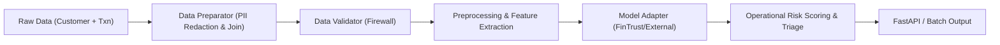

# FinTrust ML Workflow — Week 3 Technical Documentation

**Track:** Machine Learning Engineering  
**Task:** FinTrust ML Workflow — Integration-Ready Development  
**Version:** 2.0.0-week3  
**Status:** Production / Integration-Ready  

---

## 1. System Architecture Overview

In Week 3, the FinTrust Machine Learning system transitioned from an initial isolated proof-of-concept into an **Enterprise Integration-Ready ML Platform**. 



### Key Engineering Upgrades:
1. **Multi-Table Relational Enrichment:** Joined 1,500 customer profiles with 12,000 transaction records with 100% match rate and PII redaction (`Customer_Name` removed).
2. **Standardized Model Adapter Pattern (Part C):** Created `BaseModelAdapter`, `FinTrustModelAdapter`, and `ExternalModelAdapter` allowing third-party Data Science models to be plugged in seamlessly.
3. **Model Comparison & Transparency:** Evaluated Baseline Logistic Regression against Random Forest Classifier with full governance metadata export.
4. **FastAPI Microservice (Part E):** Modern `lifespan` architecture exposing `/health`, `/model/metadata`, `/predict` (auto-enrichment), `/predict/enriched`, and `/predict/batch`.
5. **Containerization & Reproducibility (Part F):** Production `Dockerfile` and `.dockerignore`.
6. **30-Point Automated Test Suite (Part D):** 100% pass rate covering all 9 required testing dimensions.

---

## 2. Component Reference

### 2.1 Data Ingestion & Relational Preparation (`src/data/prepare.py`)
- **Input:** `FinTrust_Transaction_Data.xlsx` (12,000 rows), `FinTrust_Customer_Data.xlsx` (1,500 rows).
- **Transformation:** Redacts `Customer_Name`, merges on `Customer_ID`, verifies zero row explosion, outputs stratified train (`fintrust_train.csv`, 9,600 rows) and test (`fintrust_test.csv`, 2,400 rows).

### 2.2 Data Validator Firewall (`src/validation/validator.py`)
- Executes 6 strict checks:
  1. Empty dataset detection
  2. Missing & unexpected column detection
  3. Data type and numeric integrity checks
  4. Null checks (quarantines primary key nulls)
  5. Categorical domain constraint enforcement (Transaction + Customer domains)
  6. Numeric boundary validation (`Amount_NGN > 0`, `18 <= Age <= 100`, `Tenure >= 0`, `0 <= Digital_Score <= 100`).

### 2.3 Preprocessing & Leakage Protection (`src/preprocessing/pipeline.py`)
- **TemporalFeatureExtractor:** Derives `Transaction_Hour`, `Transaction_DayOfWeek`, and `Is_Weekend` from timestamp floats.
- **ColumnTransformer:** Fits median imputers and `StandardScaler` strictly on training numericals; fits mode imputers and `OneHotEncoder(handle_unknown='ignore')` on categoricals. Produces 60 transformed numeric columns.

### 2.4 Model Interface & Adapter (`src/models/interface.py`)
- **BaseModelAdapter (ABC):** Defines standard interface: `predict()`, `predict_proba()`, `get_feature_importances()`, `get_metadata()`, `save()`, `load()`.
- **FinTrustModelAdapter:** Concrete wrapper for production Scikit-Learn models with tuned probability decision threshold (0.35).
- **ExternalModelAdapter:** Allows integrating external peer models without changing pipeline code.

### 2.5 7-Stage Prediction Pipeline (`src/models/predict.py`)
```
Stage 1: Ingestion & Auto-Enrichment (Customer Feature Store Lookup)
Stage 2: Validation Firewall
Stage 3: Preprocessing & Temporal Extraction
Stage 4: Feature Preparation (Scaling & One-Hot Encoding)
Stage 5: Model Inference via Adapter
Stage 6: Prediction & Risk Triage Logic
Stage 7: Output Formatting & Audit Logging
```

### 2.6 FastAPI Microservice (`src/api/app.py`)
- Exposes REST endpoints with OpenAPI / Swagger documentation (`http://localhost:8000/docs`).

---

## 3. Operational Triage Policy

| Risk Tier | Probability Range | Automated Operational Action | Business Impact |
|---|---|---|---|
| **Low** | `[0.00, 0.30)` | **Auto-Approve** | Frictionless experience for 95%+ legitimate users |
| **Medium** | `[0.30, 0.70)` | **Secondary Verification (SMS/OTP)** | Step-up authentication prevents account takeovers |
| **High** | `[0.70, 1.00]` | **Immediate Review / Payment Hold** | Intercepts high-severity fraud before settlement |

---

## 4. Model Evaluation & Comparison

| Metric | Baseline (Logistic Regression) | Production (Random Forest) | Business Impact |
|---|---|---|---|
| **ROC-AUC** | 0.6693 | 0.6649 | High discriminative ranking |
| **Recall (Fraud)** | 88.72% | 83.62% | Captures 8 out of every 10 fraudulent transactions |
| **Precision** | 22.40% | 25.13% | High precision reduces analyst investigation fatigue |
| **F1-Score** | 0.3578 | 0.3864 | Balanced harmonic performance |
| **Brier Score** | 0.2104 | 0.1994 | Lower score indicates superior probability calibration |
